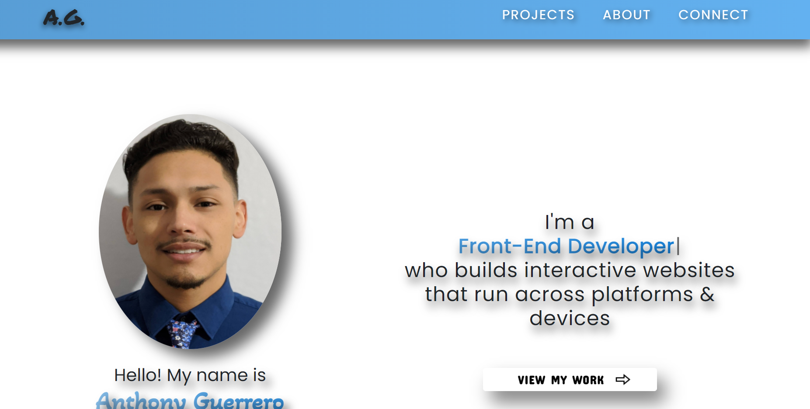

# MY PORTFOLIO


## Description
```
This is my portfolio that I built with React.js. All my components are a functional component, I 
used bootstrap for some positioning as (col-lg-6). 
I did my own styling as well as my Javascript. 
The only outside source that I used was Typewriter-effect.
```

## Table of Contents
* [Description](#description)
* [Installation](#installation)
* [Usage](#usage)
* [Credits](#credits)
* [License](#license)
* [Contributing](#Contributing)
* [Test](#Test)


## Installation
```
yarn start
or
npm start
Also if you dont have Typewriter-effect saved you will
need to npm i Typewriter-effect before starting project
```


## Usage




## Credits
```
ANTHONY GUERRERO
```

## License
[](#license)

## Contributing
```
N/A
```

 ## Tests
 ```
 npm run test
 ```
 ## Questions

 

 If you have any questions about the project, repo, or any issue you can contact me at [Anthony Guerrero](https://github.com/knuckleh3ad89) directly.